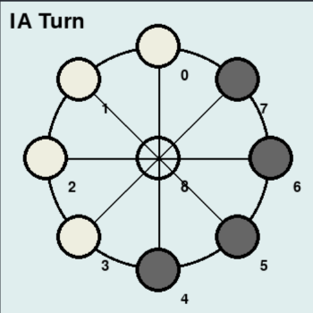
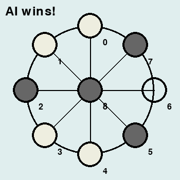

# Mu Torere Game - Q-learning Algorithm (Reinforcement Learning)
## Overview :

This project implements the traditional Mu Torere board game using the Q-learning algorithm, a well-known method in reinforcement learning. 
The goal of the AI agent in this project is to learn optimal strategies for playing Mu Torere, improving its performance over time by interacting with the environment and learning from its successes and mistakes.

The game is designed to demonstrate how reinforcement learning can be applied to solve board games by training an agent that becomes better with each episode.

## Features :
- Q-learning implementation: The AI learns the game through exploration and exploitation, using rewards to reinforce its decision-making process.
- Dynamic Learning: Over time, the AI improves its strategies and gameplay performance based on the reinforcement learning technique.
- Visual Results: The game’s progress and performance improvements are displayed throughout training.

## Q-learning Algorithm Overview :
Q-learning is a type of reinforcement learning algorithm that allows an agent to learn the optimal actions to take in various states in order to maximize cumulative rewards. 
The AI agent in this project learns how to play the Mu Torere game by interacting with the environment, using the following steps:
- **Initialization**: The agent initializes its Q-table, which will store the expected utility (reward) for each action taken in a specific state.
- **Action Selection**: Based on its exploration-exploitation strategy, the agent selects an action.
- **Learning**: After receiving the result of the action (win, loss, or tie), the agent updates its Q-table based on the reward received.
- **Iteration**: This process is repeated for many episodes, and the agent gradually improves its understanding of the game and optimal strategies.

## Project Structure :
- **mutorere.py**: Contains the full implementation of the Mu Torere game using the Q-learning algorithm.
- **README.md**: Provides details about the project, setup instructions, and an overview of how the Q-learning algorithm is applied.
  
## Results :
As the game progresses, the AI agent’s performance improves over time. You can track the number of wins, losses, and ties to see how the agent evolves with each episode.

## Screenshots : 

